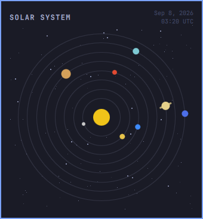

# Solar System

A bar widget for [Omarchy](https://omarchy.org/) Quattro. Click the orbit icon for a compact, live view of the planets.



Positions are computed locally from JPL’s approximate Keplerian elements (Standish, 1800–2050). There is no network, no NASA API, and no extra packages.

Plugin id: `mbilenko.sol`

## Install

```sh
omarchy plugin add https://github.com/mbilenko03/omarchy-sol.git --enable
```

Place it next to weather:

```sh
omarchy bar put mbilenko.sol --after omarchy.weather
```

## Usage

- Left-click the bar icon to open or close the panel
- Hover a planet for its name and distance from the Sun
- Escape closes the panel
- Tab / Shift+Tab walks to neighboring bar panels

```sh
omarchy-shell shell summon mbilenko.sol '{}'
```

## Remove

```sh
omarchy plugin remove mbilenko.sol
```

## License

MIT. See [LICENSE](LICENSE).

## Security

Third-party Omarchy plugins run unsandboxed inside `omarchy-shell` with your user permissions. This plugin does not start processes, does not touch the network, and does not write configuration except through the normal bar layout. Review the source before enabling it.
